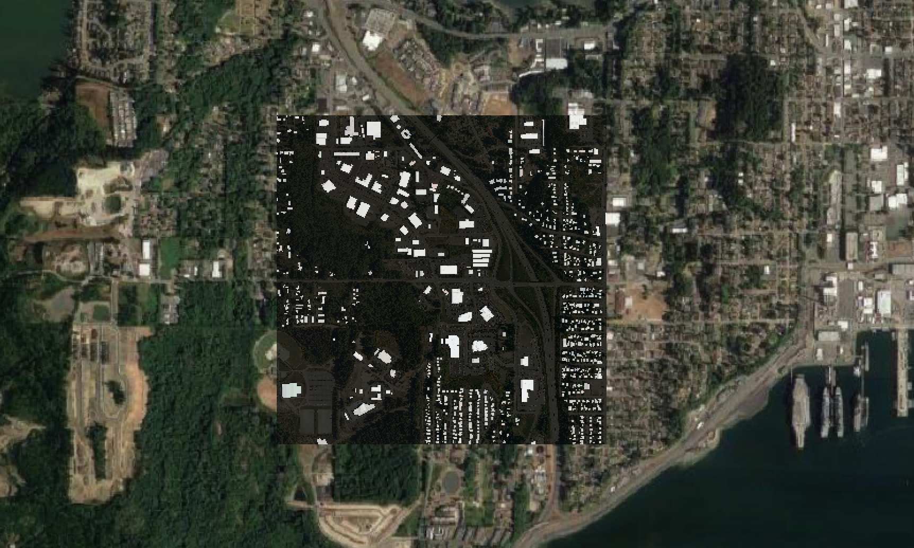
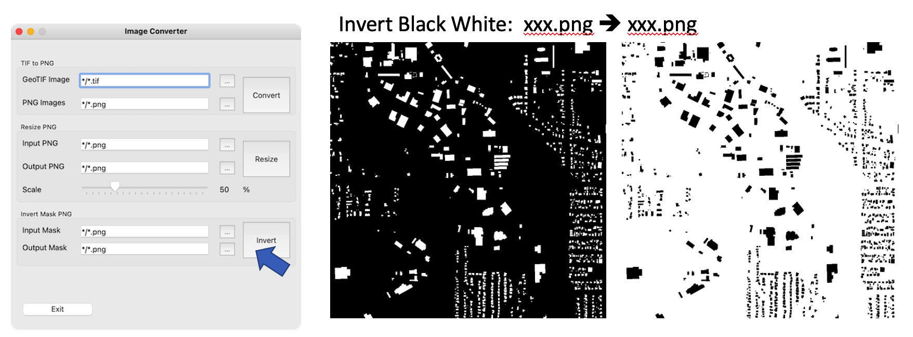

# Small Python Tools for Aerial Image Processing

Start Date: Sun 25 July 2021.

This repo provides some Aerial Image Processing tools for sample processing before building Deep Learning models.

Use Qt6 to build a basic GUI interface for the function.

## Basic Function List

- Convert GeoTIF to PNG
- Resize PNG image
- Invert Mask image value

## Project File List

The data folder contains few sample images.

```bash
.
├── QGIS_DataVIS.qgz
├── README.md
├── data
│   ├── PNG
│   │   ├── 1000x1000
│   │   │   ├── GT.png
│   │   │   └── RGB.png
│   │   └── RAW
│   │       ├── GT.png
│   │       ├── Overlay.png
│   │       └── RGB.png
│   └── TIF
│       ├── TIF_GT
│       │   └── kitsap11.tif
│       └── TIF_INPUT
│           └── kitsap11.tif
├── doc
│   ├── GUI.png
│   ├── Sample_ConvertTIF.png
│   ├── Sample_InvertBW.png
│   ├── Sample_Resize.png
│   └── feature_image.png
├── gui
│   ├── doc.md
│   ├── ui_form.py
│   └── ui_form.ui
├── run_app.py
├── setup.py
└── utils
    ├── TIFtoPNG.py
    ├── imageOverlay.m
    ├── invertBW.py
    └── resizePNG.py
```

Run GUI by command:

```bash
python run_app.py
```

Select the input image and output folder. Then click the button to run.

## Sample Image



## GUI Design


## Example

**Convert TIF to PNG**


**Resize PNG to PNG with Scale**


**Invert Mask PNG (Black/White)**


## To be continued

- batch converting image folder
- GUI update
